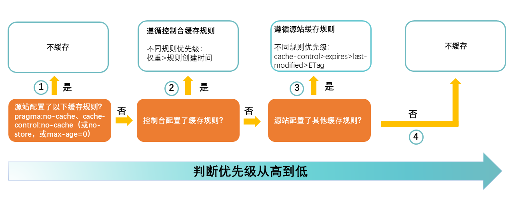

# How aliyun cdn cache works?

> https://docs-aliyun.cn-hangzhou.oss.aliyun-inc.com/pdf/cdn-FAQ-cn-zh-2016-05-06.pdf
> Ref: https://help.aliyun.com/zh/cdn/user-guide/add-a-cache-rule
> 
> **源站 no-cache > CDN 控制规则 > 源站缓存规则**

当设置 Header: `Cache-Control: public, max-age=86400`

浏览器本地缓存:
当浏览器第一次请求这个资源时，它会接收到带有 Cache-Control 头的响应。
浏览器会根据 max-age 的值将资源存储在本地缓存中，对于接下来的 86400 秒（1 天），如果有相同的请求发出，浏览器将直接使用本地缓存的资源，而不会向服务器发起请求。
在缓存过期后，如果再次需要该资源，浏览器会向服务器发起新的请求。

阿里云 CDN 缓存:
CDN 节点在接收到第一个包含这个 Cache-Control 头的响应后，会将资源缓存起来。
对于后续的请求，如果它们经过同一个 CDN 节点，并且缓存尚未过期，CDN 节点会直接提供缓存的资源，减少对源站的访问，从而减少延迟和源站的负载。
CDN 缓存过期后，CDN 会向源站请求新的副本，并根据新的 Cache-Control 头信息更新 CDN 节点上的缓存策略和资源。

源站:
源站是资源的原始服务器。当源站第一次响应请求并设置了 Cache-Control 头后，它通常不会再收到后续的请求，直到缓存过期。
如果 CDN 或者浏览器的缓存过期了，它们会再次向源站请求资源。
源站需要正确配置缓存头信息，以确保 CDN 和浏览器遵循其意图进行缓存。
对于动态内容或者频繁更新的资源，可能需要更短的 max-age 值或者其他缓存策略。而对于不变的资源（如版本化的 JS/CSS 文件），可以设置更长的 max-age 值或者使用 immutable 指令来优化缓存。

请记住，Cache-Control 仅是缓存策略的一部分。其他因素，如 ETag/If-None-Match 或 Last-Modified/If-Modified-Since 头，也会影响缓存的验证和资源的重新获取。

但是，当 CDN 控制台设置了规则后，控制台的缓存规则会覆盖源站的缓存规则。
