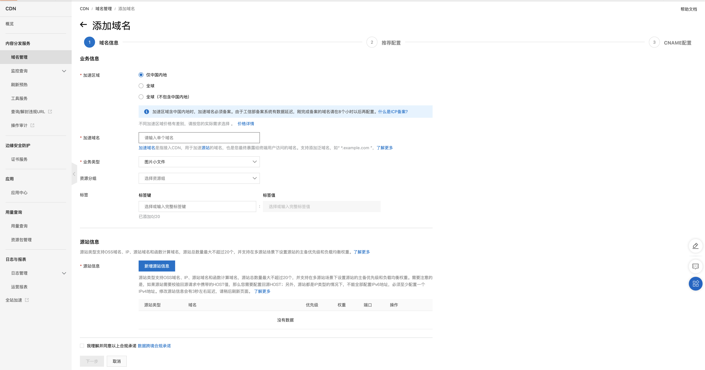
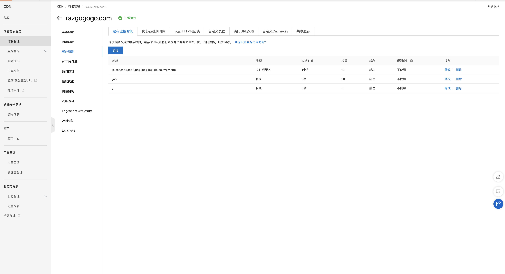

# How to deploy static web on CDN

## Steps

### Deploy your code on ecs

> Nginx/git should already have been installed
> use uniapp application as example

````bash

```bash
cd /var/www/html
git clone {your repo}
yarn build:h5
````

### Config nginx

```bash
cd /etc/nginx/conf.d
touch {your domain}.conf
```

```nginx
server {
    listen 80;
    server_name razgogogo.com www.razgogogo.com;
    # if ($http_x_forwarded_proto = "http") {
    #     return 301 https://$host$request_uri;
    # }
    # rewrite ^(.*)$ https://$host$1 permanent;

    root /var/www/html/goraz-mp-uniapp-portal/dist/build/h5;
    index index.html;

    location / {
        try_files $uri /index.html;
    }

    location /api {
        proxy_pass https://verbose-portal.shuwenkeji.cn;
    }

    location ~* \.html$ {
        add_header Cache-Control "no-cache, no-store, must-revalidate";
        add_header Pragma "no-cache";
        add_header Expires "0";
    }

    location ~* \.(js|css)$ {
        expires 1M;
        add_header Cache-Control "public";
    }

    location ~* \.(jpg|jpeg|png|gif|ico|svg|webp)$ {
        expires 1h;
        add_header Cache-Control "public, stale-while-revalidate=2592000";
    }
}
```

### Setup CDN in Aliyun OSS



### Setup DNS for CNAME


### Cache Config


