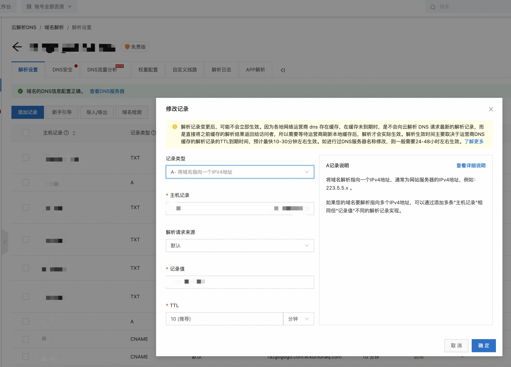
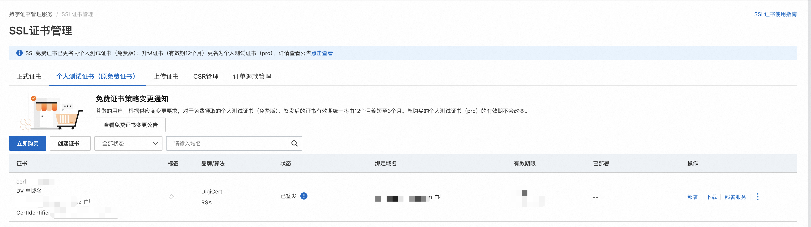
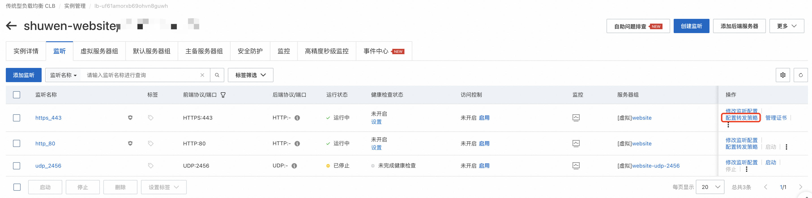
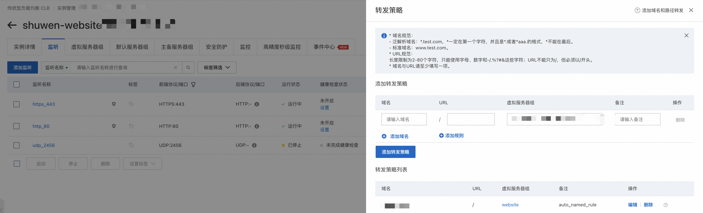
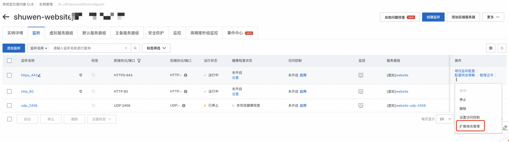
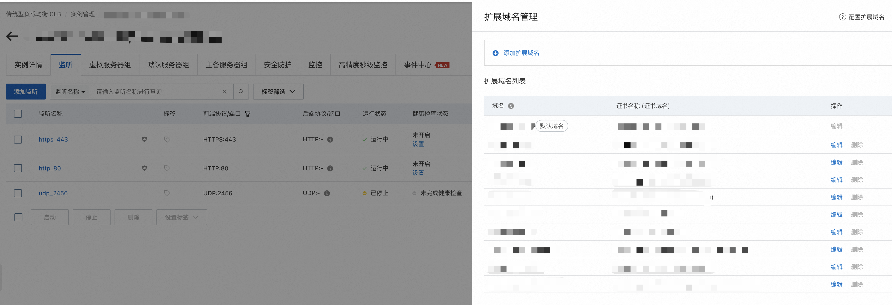

# How to deploy static web on server?

## Steps

### Deploy your code on ecs

> Nginx/git should already have been installed
> use create-react-app application as example

````bash

```bash
cd /var/www/html
git clone {your repo}
yarn build
````

### Config nginx

```bash
cd /etc/nginx/conf.d
touch {your domain}.conf
```

```nginx
server {
    listen 80;
    server_name {your domain}.com www.{your domain}.com;
    root /var/www/html/{your folder}/build;
}
```

Reload your nginx with new config

```bash
nginx -s reload
```

## Setup your domain in DNS
https://dns.console.aliyun.com/


Till now you should able to access your webpage in public internet with HTTP protocol.

# How to setup HTTPS for your website?

## Get your SSL Certification
https://yundun.console.aliyun.com/


## Setup in SLB
https://slb.console.aliyun.com/
Slb to configure the corresponding forwarding rules and extended certificates




