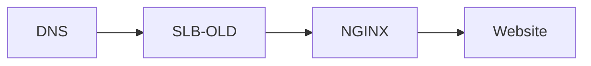
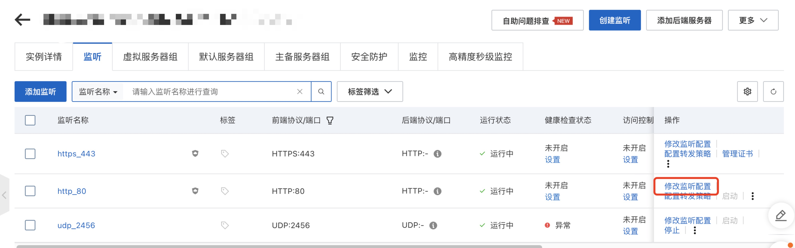
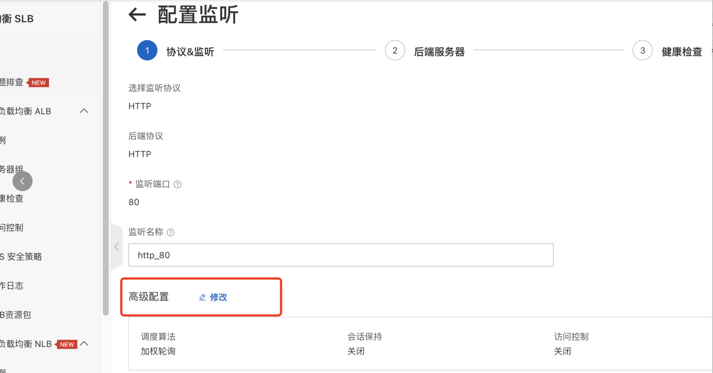
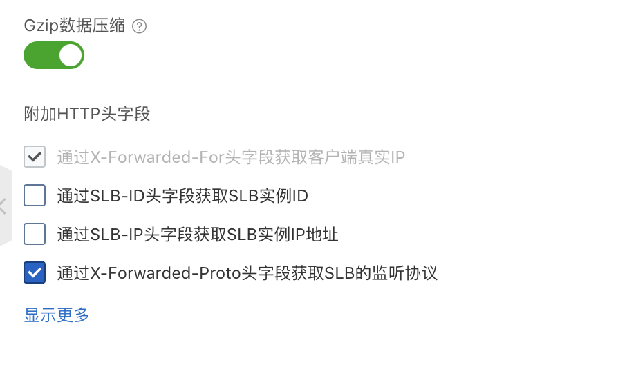
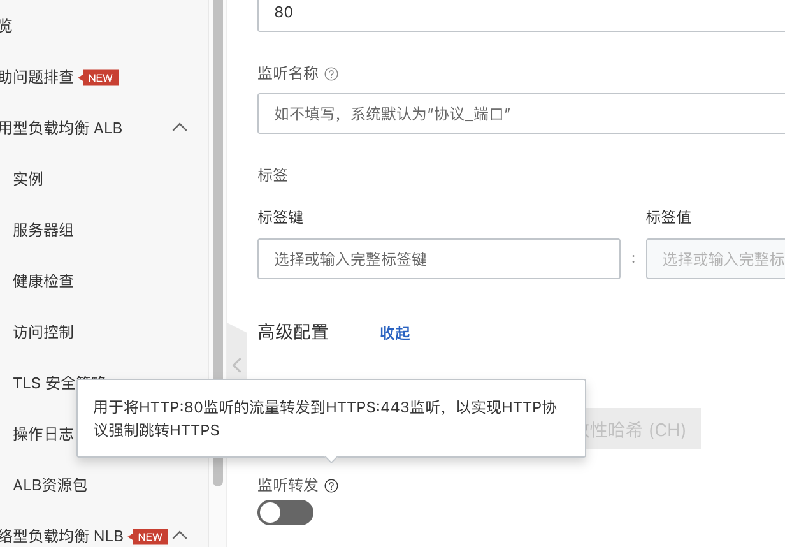

# How to redirect all HTTP requests to HTTPS

## Current Arch Flow



## Add Config on SLB

> get protocol by X-Forwarded-For





## Update Nginx Config

```nginx
server {
    listen 80;
    server_name {domain}.com www.{domain}.com;
    if ($http_x_forwarded_proto = "http") {
        return 301 https://$host$request_uri;
    }
    # rewrite ^(.*)$ https://$host$1 permanent;

    location / {
        root /var/www/html/{project}/dist;
        index index.html;
        try_files $uri /index.html;
    }

    location /api {
        proxy_pass https://{backend.domain};
    }
}
```

## Better Solution for New SLB


