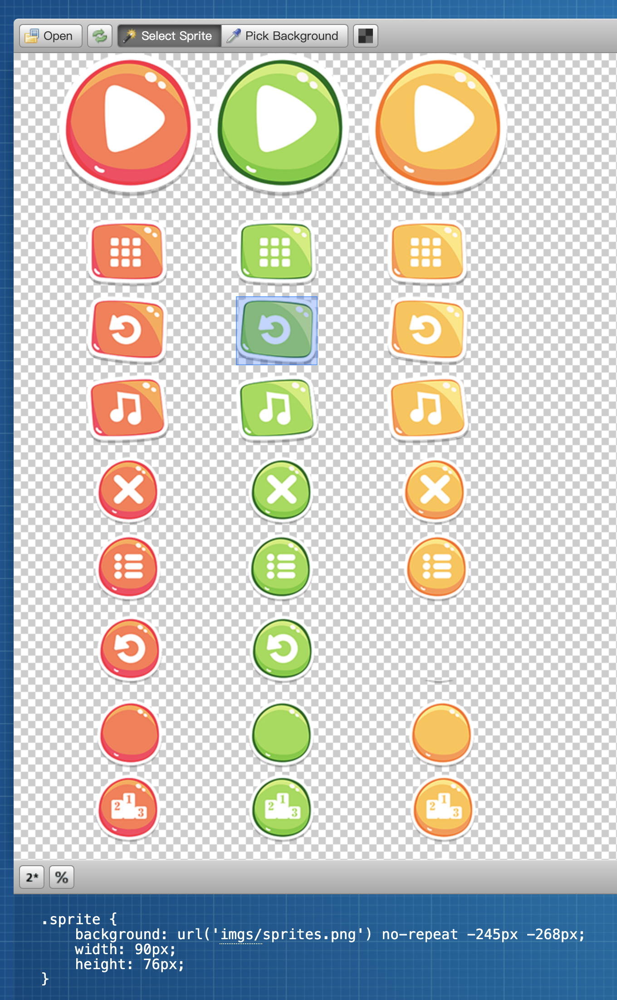
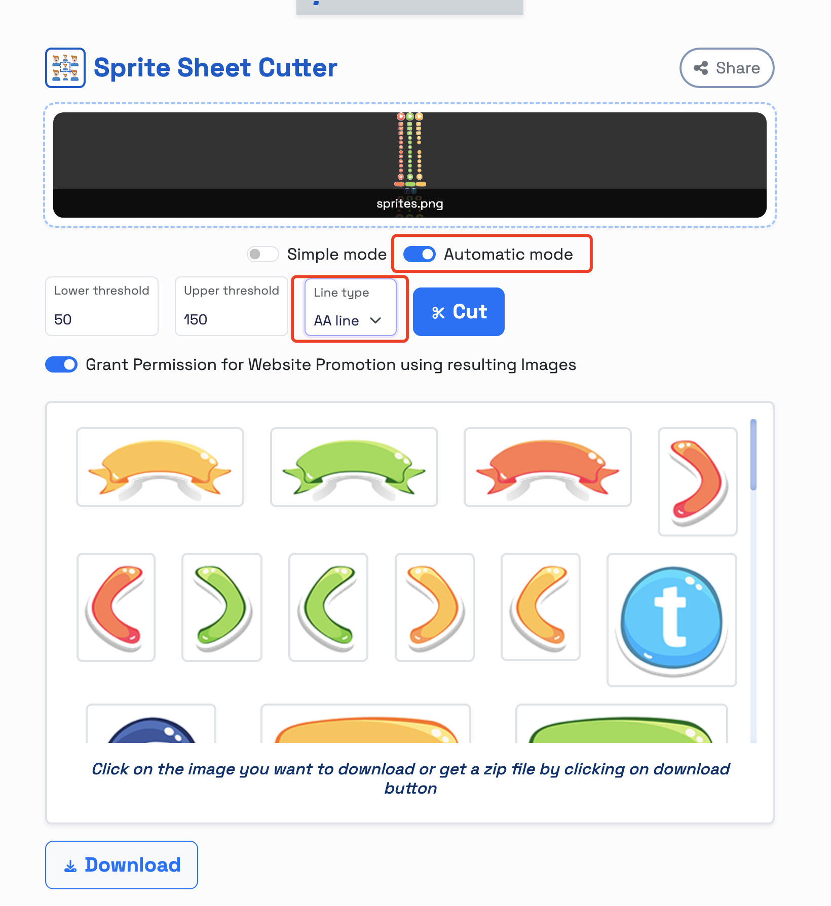

# How to use and cut sprite image

## How to easily find the coordinates of the sprite image

> http://www.spritecow.com/  
> use this online tool to find the coordinates of the sprite image

## How to automatically cut sprite image

> https://www.tools3ox.com/tools/images/ssc/  
> use this online tool to cut the sprite image

## How to remove the background color of the sprite image

> https://www.remove.bg/  
> use this online tool to remove bg color of sprite image
